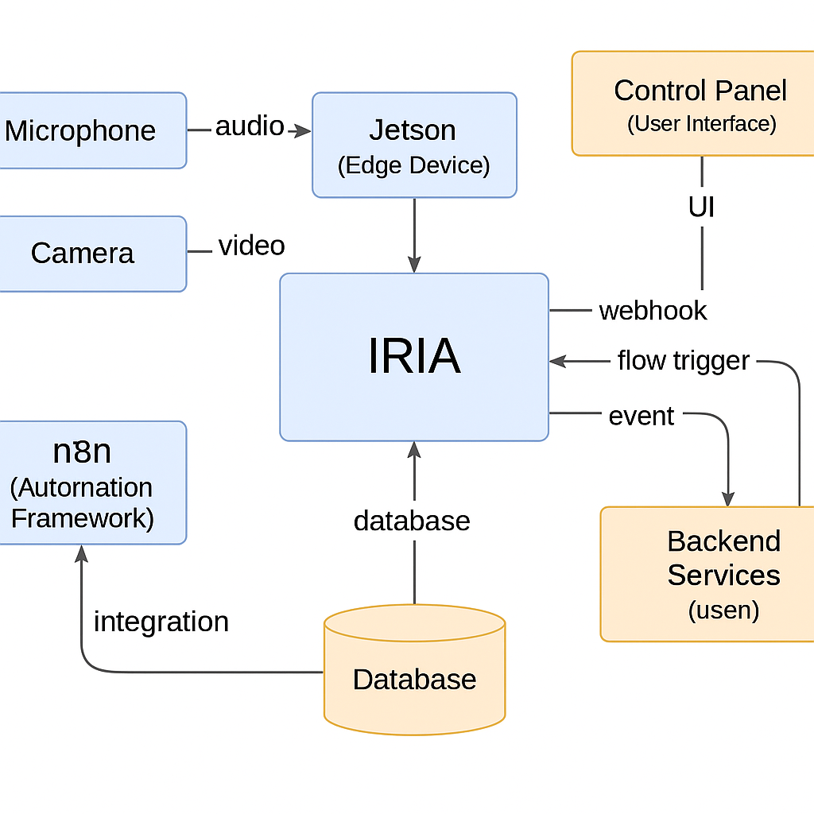

# Architektura systemu IRIA z n8n

Poniższy diagram przedstawia ogólną strukturę logiczną systemu IRIA, w którym n8n pełni rolę centralnego integratora i koordynatora zdarzeń.

---

## Komponenty systemu:

### 🎤 Mikrofon
Urządzenie rejestrujące dźwięk – np. ESP32 z mikrofonem MEMS. Wysyła strumień audio lub dane triggerujące (np. detekcja słowa-klucza) do urządzenia Jetson.

### 📷 Kamera
Źródło obrazu – może być to kamera IP lub USB. Wideo trafia bezpośrednio do Jetsona, gdzie odbywa się analiza wizyjna (np. rozpoznawanie twarzy lub pojazdów).

### 🧠 Jetson Nano (Edge Device)
Urządzenie brzegowe wykonujące analizę lokalnie. Przetwarza dane z mikrofonu i kamery, przekazuje przetworzone zdarzenia do głównego modułu IRIA (np. “rozpoznano osobę X w kuchni”).

### 💡 IRIA
Główna logika decyzyjna systemu. Rejestruje zdarzenia, wykonuje analizę kontekstową, komunikuje się z n8n oraz kontroluje inne moduły.

### 🔁 n8n (Automation Framework)
Silnik automatyzacji. Odbiera zdarzenia z IRIA (webhook, trigger, harmonogram) i uruchamia odpowiednie przepływy (flowy), np. reakcję głosową, zapis do logów, wysyłkę komunikatu, sterowanie oświetleniem.

### 🗃️ Baza danych
System przechowywania zdarzeń, aktywności, historii rozpoznań i konfiguracji użytkownika. Współdzielona między IRIA a n8n.

### 🧩 Backend Services (np. `usen`)
Usługi wspomagające: logika harmonogramów, zewnętrzne moduły przetwarzania, przyszłe API do integracji VR lub asystenta webowego.

### 🖥️ Control Panel (UI)
Panel użytkownika – może być to dashboard webowy lub interfejs VR. Umożliwia zarządzanie stanem systemu, przegląd historii, ręczne wyzwalanie akcji.

---

## 📡 Przepływ danych

- **Mikrofon / kamera** → **Jetson** → **IRIA** → trigger webhooka do **n8n**
- **n8n** może odpalić flow, zaktualizować bazę danych, przekazać dane z powrotem do **IRIA**
- **UI** może reagować na zmiany lub ręcznie wyzwalać akcje w IRIA

System działa w pełni lokalnie, a internet jest używany tylko jeśli użytkownik wyrazi zgodę (np. do aktualizacji lub eksportu danych).
